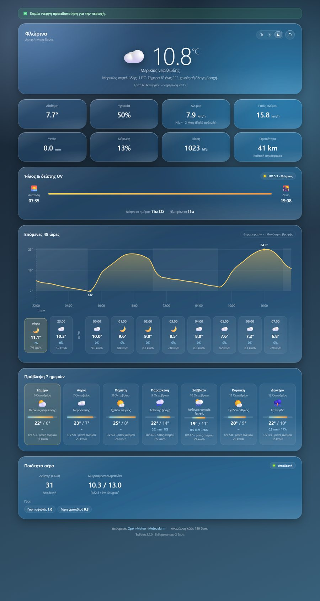
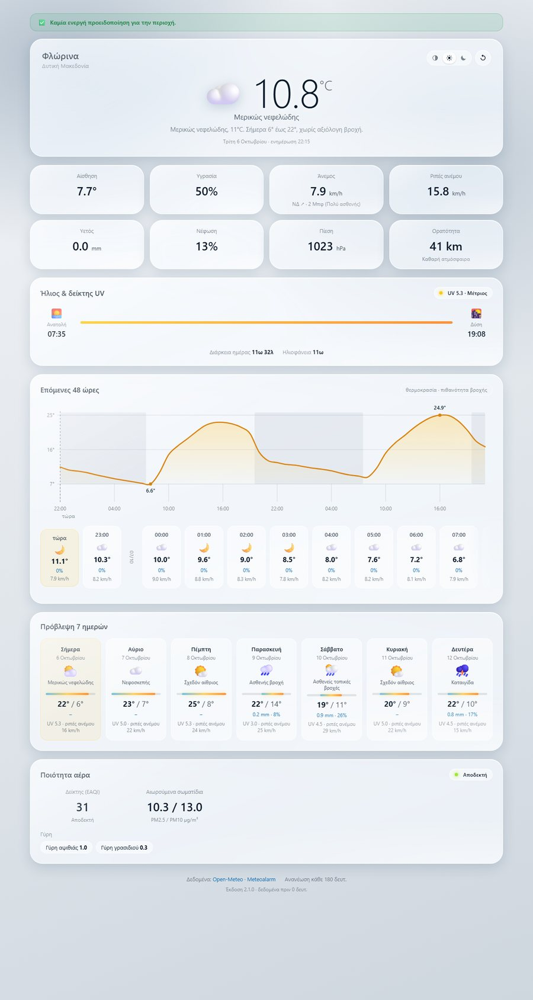

# Καιρός · Φλώρινα (Florina Weather)

[](https://github.com/oxezz/florina-weather/actions/workflows/tests.yml)

A small self-hosted weather page for **Φλώρινα, Δυτική Μακεδονία**, in Greek.
Python standard library only — no `pip install`, no API key, no build step.
Requires **Python 3.9 or newer**.

**Live:** <https://florina-weather.wasmer.app/> — or run your own with the
command below.

```bash
cd florina-weather
python app.py
```

Then open **http://127.0.0.1:8000**.

---

## Deploying it

The repo is ready to push to GitHub and deploy from there. Nothing needs
installing, because the app has no dependencies.

**Any container host** — Render, Fly.io, Railway, a VPS. Point it at the repo;
it builds the [`Dockerfile`](Dockerfile) and runs. The image binds
`0.0.0.0:8000` and honours the generic `PORT` variable those platforms inject,
so there is nothing to configure.

**Wasmer Edge** works, and is verified in production: it runs the app
unmodified, including the threaded HTTP server. It does need the CA bundle
described below, which is why `cacert.pem` is committed.

**Static hosts will not work** — GitHub Pages, Netlify and Cloudflare Pages
serve files, and this is a running server that fetches and caches upstream data.

CI runs the whole suite on every push across Python 3.9, 3.12 and 3.13
([`.github/workflows/tests.yml`](.github/workflows/tests.yml)).

### TLS trust store

Minimal hosts often ship no CA bundle at all. Wasmer Edge's Python runtime, for
instance, loads **zero** certificates into its default context, so every HTTPS
call fails with `CERTIFICATE_VERIFY_FAILED`.

So [`cacert.pem`](cacert.pem) — Mozilla's CA list, via
[curl.se](https://curl.se/ca/cacert.pem) — ships with the app. The precedence is:

1. `SSL_CERT_FILE`, `REQUESTS_CA_BUNDLE` or `CURL_CA_BUNDLE`, if set and valid
2. the host's own store, *if it genuinely contains certificates*
3. the bundled `cacert.pem`

`/api/health` reports which one is active under `"tls"`. Refresh the bundle
occasionally by re-downloading it from curl.se.

That file is Mozilla's data, distributed under the **MPL-2.0**, and is not
covered by this project's MIT licence.

---

## Features

| | |
|---|---|
| **Current conditions** | temperature, apparent temperature, humidity, wind (speed, direction, arrow and Beaufort), gusts, precipitation, cloud cover, pressure and visibility |
| **48-hour outlook** | an inline SVG chart of temperature with precipitation-probability bars and night shading, plus a horizontally scrollable hour-by-hour strip |
| **7-day forecast** | per-day icon, description, min/max with a relative range bar, rainfall, UV and peak gusts |
| **Official warnings** | live **Meteoalarm / EMY** alerts for West Macedonia, colour-coded, shown as a banner at the top |
| **Air quality** | European AQI, PM2.5 / PM10 and pollen (grass, olive, ragweed, mugwort, birch, alder) |
| **Local conditions** | Hyper-local cards for the basin climate: **frost risk** for growers, **heating degree days** for the month, and the evening **wood-smoke** build-up. Each card is simply absent when it has nothing to say, so the whole panel disappears in summer |
| **Live updates** | the page refreshes itself in place — no reload, no flicker — and pauses while the tab is hidden |
| **Installable (PWA)** | A manifest and a service worker, so "Add to Home Screen" gives a standalone app with no URL bar — and the refresh button is always there for an immediate update |
| **Works offline** | The shell is cached, so a repeat launch is instant and an offline reload still shows the last weather with an «εκτός σύνδεσης» note rather than the browser's error page |
| **Loading skeletons** | 31 placeholders shaped like the real content, so the first paint already looks finished and nothing jumps when the data lands. They stay invisible for the first 350 ms, because a skeleton that flashes for two frames looks worse than none |
| **Light & dark** | an iOS-style segmented control (Αυτόματα / Φωτεινό / Σκοτεινό). The choice is remembered and can be linked with `?mode=dark` |
| **Liquid-glass surfaces** | translucent saturated blur, a specular rim along the top edge, a sheen out of the top-left corner, and a highlight that follows the pointer. All of it degrades gracefully — with no hover or no JavaScript the panels still read correctly |
| **Weather-aware backdrop** | shifts between clear-day, clear-night, cloud, rain, snow, storm and fog, in both light and dark |

### Appearance

The mode is independent of the weather theme: `html.mode-light` / `html.mode-dark`
sets the *material* (text, glass tint, shadows) and `body.theme-*` sets the
*backdrop hue*. Auto follows `prefers-color-scheme` live.

`?mode=light` or `?mode=dark` overrides the stored choice for one visit without
saving it, so a particular look is linkable.

| Dark | Light |
|:----:|:-----:|
| [](docs/dark.jpg) | [](docs/light.jpg) |

---

## How it works

```
   ┌──────────────────────┐
   │ Open-Meteo  forecast │──┐
   │ Open-Meteo  air      │──┤
   │ Open-Meteo  history  │──┼──►  sources.py  ──►  report.py  ──►  app.py  ──►  app.js
   │ Meteoalarm  warnings │──┘     fetch,           normalise        HTTP:        render,
   └──────────────────────┘         TTL cache,       into one         shell,       poll,
                                    stale-if-error   JSON doc         JSON API     update in place
```

| File | Purpose |
|------|---------|
| `app.py` | CLI, HTTP server, routing. Serves the shell, `/api/weather`, `/api/health` and an allow-list of static files |
| `sources.py` | Configuration plus the four upstream clients, the TTL cache and stale-if-error handling |
| `report.py` | Pure functions that turn raw upstream payloads into the document the UI consumes |
| `greek.py` | Greek vocabulary: WMO code → description + emoji, compass, Beaufort, UV/AQI bands, dates |
| `template.html` | The page shell. Only five placeholders, all server-filled |
| `theme.js` | Appearance bootstrap, loaded from `<head>` so light mode never flashes dark |
| `app.js` | Fetches `/api/weather` and renders it. Never injects upstream text as HTML |
| `style.css` | Glass material, light/dark tokens, the seven weather backdrops, layout |
| `sw.js` | Service worker: offline shell, and what lets Android offer "Install app" |
| `manifest.webmanifest` | Web app manifest — name, icons, standalone display |
| `Dockerfile` | Container image for Render / Fly / any container host |
| `cacert.pem` | Mozilla CA bundle, used when the host has no trust store |
| `tests/` | 221 tests, all offline |

### API

* `GET /` — the page
* `GET /api/weather` — the full JSON document; add `?force` to bypass the forecast cache
* `GET /api/health` — last success and last error per source

Errors are returned as HTML when a browser is navigating and as JSON when
`Accept: application/json` is sent, so the client can always parse the response.

---

## Configuration

Every flag has a matching `FLORINA_*` environment variable.

```bash
python app.py --port 8080 --place Φλώρινα --refresh 120 --verbose
FLORINA_PORT=8080 FLORINA_REFRESH=120 python app.py
```

| Flag | Env | Default | Meaning |
|------|-----|---------|---------|
| `--host` | `FLORINA_HOST` | `127.0.0.1` | Bind address. Use `0.0.0.0` to reach it from other devices |
| `--port` | `FLORINA_PORT` | `8000` | TCP port |
| `--place` | `FLORINA_PLACE` | `Φλώρινα` | Town name on the page |
| `--region` | `FLORINA_REGION` | `Δυτική Μακεδονία` | Region name on the page |
| `--lat` / `--lon` | `FLORINA_LAT` / `FLORINA_LON` | `40.7822` / `21.4097` | Coordinates |
| `--refresh` | `FLORINA_REFRESH` | `600` | Client refresh interval, seconds. Open-Meteo's models update roughly every 15 minutes, so polling much faster only burns bandwidth |
| `--cache-ttl` | `FLORINA_CACHE_TTL` | `600` | Server-side forecast cache, seconds |
| `--forecast-days` | `FLORINA_FORECAST_DAYS` | `7` | Days in the daily forecast |
| `--forecast-hours` | `FLORINA_FORECAST_HOURS` | `48` | Hours in the chart and strip |
| — | `FLORINA_HISTORY_DAYS` | `45` | Days of daily history fetched for the heating-degree total |
| `--alert-areas` | `FLORINA_ALERT_AREAS` | `west macedonia,δυτική μακεδονία` | Which Meteoalarm areas to show |
| `--alert-emma-ids` | `FLORINA_ALERT_EMMA_IDS` | *(empty)* | Match warnings by EMMA region code instead of name |
| `--open` | — | off | Open the browser on start |
| `--verbose` | — | off | Debug logging |

**Retargeting another town** needs no code change:

```bash
python app.py --place Καστοριά --region Δυτική Μακεδονία \
              --lat 40.5167 --lon 21.2667 \
              --alert-areas "west macedonia"
```

### Warnings filter

Warnings arrive from the Greek Meteoalarm CAP feed and are matched against
`FLORINA_ALERT_AREAS`, accent- and case-insensitively (`ΔΥΤΙΚΗ ΜΑΚΕΔΟΝΙΑ` matches
`Δυτική Μακεδονία`). The Greek text of each warning is preferred over the English
one. If both `alert_areas` and `alert_emma_ids` are left empty, every current
warning is shown.

---

## Tests

```bash
python -m unittest discover -s tests -t .
```

All 221 tests run offline: upstream responses are replaced by fixtures, and the
HTTP tests start a real server on an ephemeral port with an injected opener.

## Greek wording

A few labels were deliberately chosen over the obvious alternative:

| Label | Why |
|-------|-----|
| **Ριπές ανέμου** | a *gust* is a ριπή ανέμου. "Ροή ανέμου" would be a wind **flow** — a different quantity, and not what the card shows |
| **Αίσθηση** | the card label is a noun phrase ("feels like"); "Αίσθητη" alone is a dangling adjective |
| **Υετός** | the card totals rain + showers + **snow**, so "Βροχή" would be wrong whenever it snows. Υετός is the term EMY uses |
| **Μπφ** | the conventional Greek abbreviation for μποφόρ |

---

## Notes

* **Timezone.** `report.resolve_timezone()` prefers the IANA database, but a stock
  Windows Python has none (`ZoneInfo` raises, because `tzdata` is a separate
  package). It then falls back to the `utc_offset_seconds` value Open-Meteo
  returns for the coordinates, which is correct for the forecast window. Which
  source was used is reported as `status.timezone_source`.
* **Installing it.** On Android Chrome the site offers "Install app"; on iOS use  Share → Add to Home Screen. Either way you get a proper icon and a standalone
  window with no URL bar.

  The service worker is deliberately conservative, because stale weather is
  worse than none: `/api/weather` and navigations are **network-first**, cached
  only as an offline fallback, while the shell uses **stale-while-revalidate**
  so repeat launches are instant and a deploy is picked up on the next load.
  Bump `CACHE_VERSION` in `sw.js` only when something must never be served
  stale. The worker registers over https, and on loopback so local development
  behaves the same.
* **Local conditions.** Florina sits in a basin at ~660 m, which gives the town a
  climate of its own. Three readings of data we already fetch, each shown only
  when it means something:

  - **Frost risk** — two sensors, because they disagree. The 2 m air minimum
    *and* the ground surface (`soil_temperature_0cm`); the colder of the two
    sets the warning, and both are reported. On a clear calm night the surface
    radiates heat away and runs 1–3 °C below the air, so it can freeze while the
    air is still positive — the radiation frost that catches low crops such as
    peppers. Bands at 2 / 0 / −2 / −4 °C; −2 °C is roughly where flowering fruit
    trees start to suffer, −4 °C is a crop-damaging freeze. Absent whenever no
    night comes near zero.

    Only the **0 cm** layer is a frost sensor. At 6 cm the soil sits 5–8 °C
    warmer than the surface, which is root-zone warmth rather than frost risk.
  - **Heating degree days** — `18 °C − daily mean`, totalled for the month to
    date. Uses a daily-only history call (~2 KB) so it costs one extra request.
  - **Wood smoke** — the peak PM2.5 between 18:00 and 02:00, plus the wind that
    lets it pool. Thresholds are the WHO 2021 24-hour guideline (15 µg/m³) and
    the EU daily limit (25), so it only appears on a genuinely polluted evening.
    The wind decides the *framing*, not the severity: under 12 km/h it reads as
    «αιθαλομίχλη» pooling in the basin, with the cleanest hour of the next day;
    above that the same PM2.5 is particulate blowing through, so it is labelled
    «αυξημένα σωματίδια» and the ventilation advice is dropped.
  - **Thermal inversion** — the reason Florina is colder than the villages
    above it. A standard atmosphere loses 0.65 °C per 100 m, so the card
    compares the town with a **1073 m point about 3 km south-west** and reports
    how much warmer the slope is than that rule predicts. Everything is in the
    anomaly, measured in °C, and the card says «πιθανή» rather than asserting an
    inversion when the models straddle it by more than the anomaly itself.

    Note the comparison point's height is Open-Meteo's own DEM reading, which
    disagrees with third-party elevation tools by several hundred metres. Since
    Open-Meteo also produces the temperatures, only its figure is usable here.

  None of it is invented: every number is a straight reading of the forecast,
  the air-quality call or the history call, and a failing source drops its own
  card rather than breaking the page.
* **`[hidden]` needs its guard.** The stylesheet carries
  `[hidden] { display: none !important; }`, because the attribute only works via
  the browser's own `[hidden] { display: none }` — and *any* author rule that
  sets `display` silently outranks it. Without the guard, `.local-card` and
  `.chip` stayed on screen with blank contents while the attribute insisted they
  were hidden.
* **Model agreement.** The daily cards carry a ± figure from four models —
  `best_match`, `icon_eu` (DWD, 7 km), `ecmwf_ifs025` and `gfs_seamless`. In a
  basin they routinely disagree by 4–6 °C, which is more than a typical day's
  change, so a single number would be hiding the interesting part.

  `best_match` is included deliberately even though it is a composite: it is what
  the headline forecast comes from, and leaving it out let the displayed
  temperature fall **outside** the range the spread implied.

  AROME and ICON-D2 are absent because neither covers Greece — both return
  "no data is available for this location". This measures *inter-model* spread,
  which is the structural uncertainty that matters in mountains. A single-model
  ensemble would understate it badly: ICON-EU's own 40 members spread about
  1 °C, while the models disagree by 4–6 °C.
* **The hourly strip is a chart.** Each card carries a rain-probability gauge: a
  22 px bar scaled from `--rain`, so across 48 adjacent cards the bars line up
  into one continuous picture of the day. The percentage is still printed, and
  the gauge is `aria-hidden` because it repeats what the text already says. The
  strip uses `scroll-snap-type: x mandatory` with `overscroll-behavior-x:
  contain`, so a fling settles card by card and never triggers the browser's
  back gesture at the edges.
* **Caching.** Upstream calls are cached server-side and served stale (up to six
  hours) if the network fails, so a brief outage shows slightly old data instead
  of an error page.
* **Mobile performance.** Scroll jank on phones — Firefox especially — comes from
  work the browser redoes on *every* frame. Two culprits were removed:

  - `background-attachment: fixed` repaints the whole viewport per frame. The
    backdrop is now a single `position: fixed` layer that the compositor reuses.
  - A `backdrop-filter` on all thirteen panels and cards meant thirteen blur
    surfaces re-blurring the moving backdrop every frame. Blur now lives inside
    `@media (hover: hover) and (pointer: fine)`, so a phone never pays for it,
    at half the radius it used before.

  The glass still reads as glass on touch, because what sells it is the
  translucent fill, the specular rim and the sheen — none of which cost
  per-frame work. Since the backdrop is a smooth gradient, blurring it was never
  visible anyway. A refresh also skips rebuilding the chart, the 48 hour tiles
  and the 7 day cards when that data has not changed.
* **The old EMY scraper is gone.** `oldportal.emy.gr` no longer responds, so the
  previous `extract_emy.py` / `emy_extract.py` scrapers were retired and now sit
  in [`archive/`](archive/) for reference. The HTML page dumps they produced were
  removed from the repository — that markup was EMY's, not this project's, so it
  did not belong under its MIT licence.

## Data

Weather and air-quality data from [Open-Meteo](https://open-meteo.com) — free,
no API key. Weather warnings from the official
[Meteoalarm](https://www.meteoalarm.org) CAP feed, as issued by EMY.

## Licence

[MIT](LICENSE) © 2026 oxezz.
